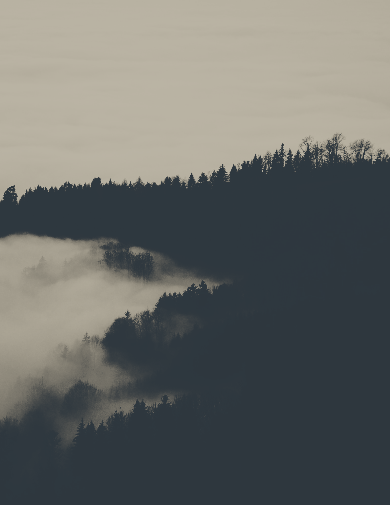
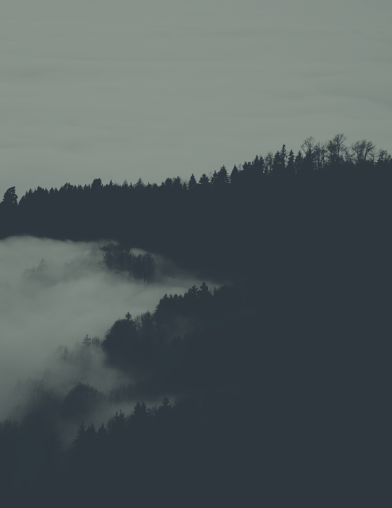
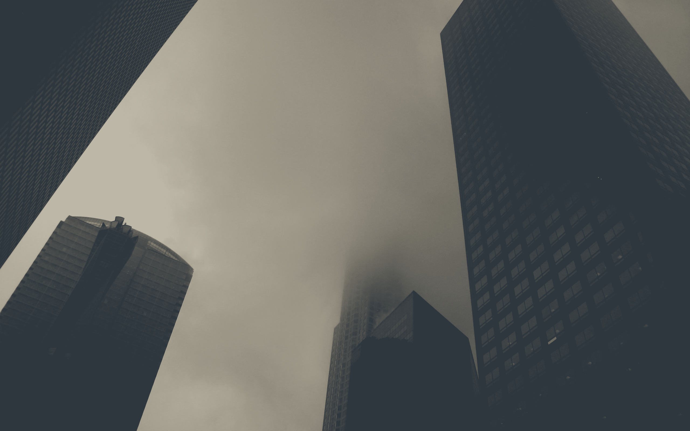
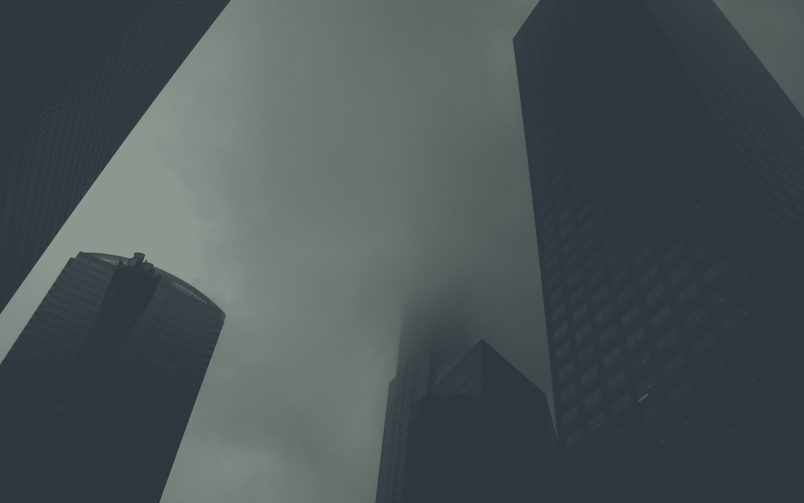

# everforest-walls

Collection of wallpapers I recolored to the [Everforest colorscheme](https://github.com/sainnhe/everforest)

Recolored for Hard Dark, using the old palette (before [c7d3ffe](https://github.com/sainnhe/everforest/commit/c7d3ffec0a4725c5154c824f0d036fa26a40232a))

Newer wallpapers will have a `_1` or `_2` suffix. 1 means that the highlights are recolored to around #d3c6aa (the main foreground color) and 2 means that they are instead #859289 (gray1 or the comment foreground color)

  
Preview of some of the wallpapers

  | **No variants** (older recolors)       | **Variant 1**                    | **Variant 2**                    |
  :---------------------------------------:|:--------------------------------:|:---------------------------------:
  |  |  |  |
  |             |     |     |
  |         |   |   |
  |             |       |       |
  |            |     |     |

  (yeah row 3 variants don't have that much of a diff)

## How I recolor

The newer wallpapers (the ones with the `_1` or `_2` suffix) are done in Blender using the [Color Ramp node](https://docs.blender.org/manual/en/latest/render/shader_nodes/converter/color_ramp.html), which basically uses the brightness of each pixel to determine how far along a gradient (of grays from the colorscheme) it should be recolored to (In-depth tutorial coming when I have enough free time).

The older wallpapers were manually tweaked in GIMP using curves, levels, and HSL tools until the colors looked right.

## Comparison to alternative methods

[lutgen](https://github.com/ozwaldorf/lutgen-rs):
- Pro: Color Ramp gives more control over color intensity
- Con: Color Ramp makes the image look monochrome because it selects target colors purely by brightness

[shmap](https://codeberg.org/Figgles/shmap):
- Pro: Color Ramp gives more control over color intensity (gradient stops)
